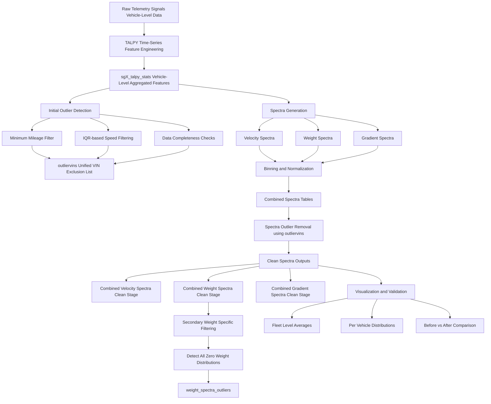

# Commercial-Vehicle-Telemetry-Analytics-Pipeline
⭐ **Introduction**

Modern commercial vehicles generate high-frequency telemetry data that is rich but highly unstructured, noisy, and inconsistent across fleets.

This project builds an end-to-end telemetry analytics pipeline that transforms raw vehicle signals into structured, analysis-ready representations. 
It enables fleet-level comparison, behavioral analysis, and data-driven validation across multiple vehicle groups using scalable PySpark workflows.

---

🧩 **Problem Complexity & Motivation**

Processing commercial vehicle telemetry at scale introduces several challenges:

• **High variability in raw signals** across vehicles, routes, and operating conditions  
• **Noisy and incomplete time-series data**, requiring multi-stage validation and cleaning  
• **Heterogeneous feature distributions**, making direct comparisons across vehicles unreliable  
• **Need for robust aggregation logic** to convert time-series signals into meaningful fleet-level representations  
• **Outlier sensitivity**, where a small number of vehicles can heavily bias fleet statistics  

To address this, the pipeline implements a structured multi-stage framework involving feature engineering, statistical filtering, spectra generation, and validation-based visualization.

---

🎯 **Objectives**: Tha main goals of this project are    

•	Generate load spectra representations from raw telematics time-series data   
•	Compute fleet-level statistical summaries (velocity, weight, gradient, fuel consumption and other derived metrics)   
•	Identify and remove data quality issues and outliers   
•	Provide interpretable visualizations for validation and analysis   
•	Produce curated datasets for downstream analytics and catalog storage   

---

🛠 **Tech Stack**   

•	Apache Spark (PySpark) – distributed data processing   
•	Pandas / NumPy – intermediate transformations and validation   
•	Matplotlib – fleet-level visual analytics   
•	TALPY Time-Series Framework – statistical feature engineering layer   
•	Delta Lake / Databricks Tables – persistent storage layer   

---

🚀 **Pipeline Architecture Overview**

---

📊 **Project Outcomes - Key Numbers**

This pipeline operates at commercial fleet scale and processes large-scale telematics data:

• 🚛 21,000+ commercial trucks analyzed 
• 🧑 300+ individual customers analyzed
• 📡 30+ telemetry signals processed per vehicle  
• 🧠 3 major feature domains (velocity, weight, gradient)  
• 📊 15 powertrain configurations evaluated (SG1–SG15)  
• ⚙️ 400 billion+ time-series records transformed into structured analytics features  
• 📦 11 curated Delta tables generated for downstream analytics  

---

📈 **Sample Visualizations**

---

⚠️ **Data Note**

This project uses proprietary internal datasets from Daimler Truck AG.  
Only the processing pipeline and code structure are shared in this repository for demonstration and learning purposes.  
No raw or sensitive data is included.

---

