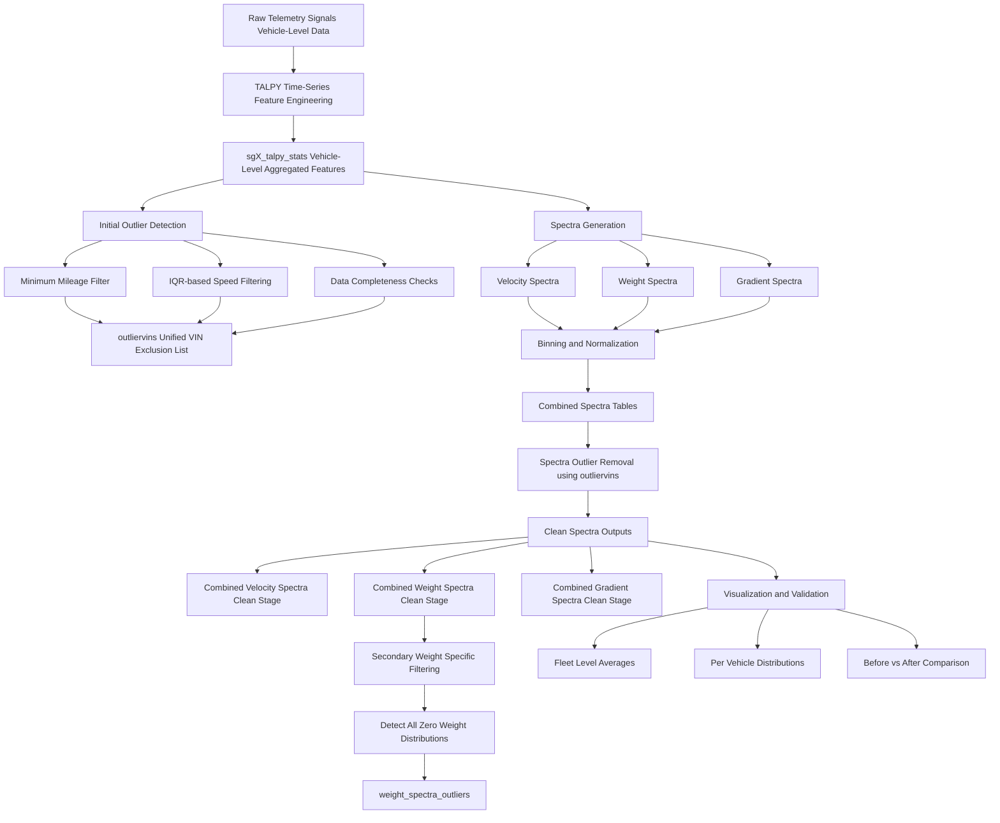
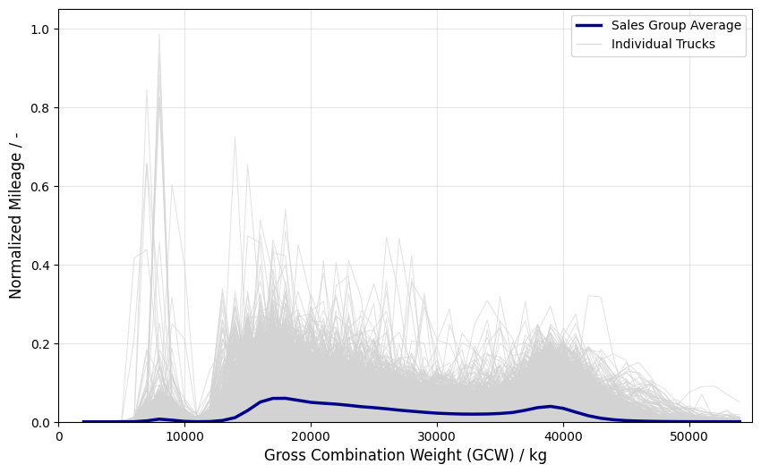
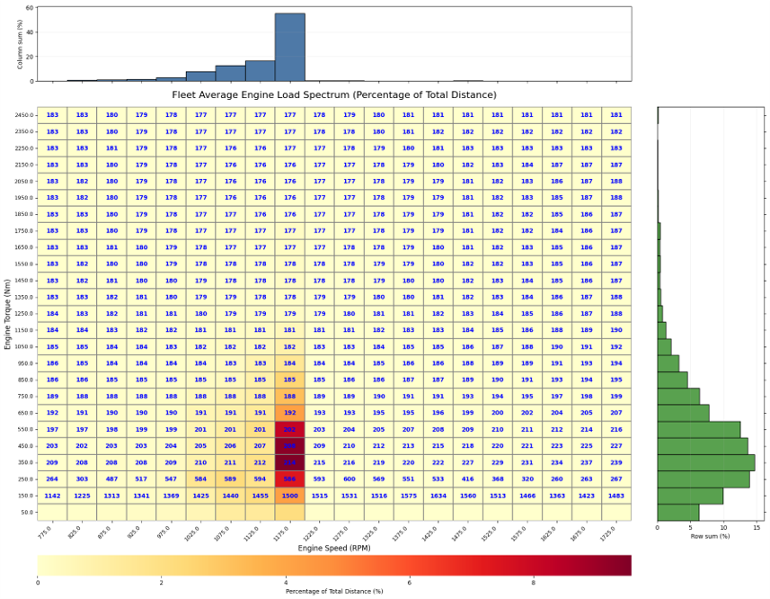
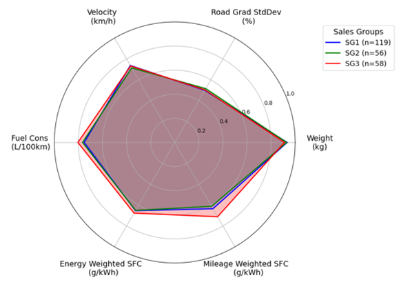
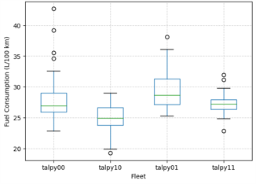

# Commercial-Vehicle-Telemetry-Analytics-Pipeline
⭐ **1. Introduction**

Modern commercial vehicles generate high-frequency telemetry data that is rich but highly unstructured, noisy, and inconsistent across fleets.

This project builds an end-to-end telemetry analytics pipeline that transforms raw vehicle signals into structured, analysis-ready representations. 
It enables fleet-level comparison, behavioral analysis, and data-driven validation across multiple vehicle groups using scalable PySpark workflows.

---

🧩 **2. Problem Complexity & Motivation**

This project addresses the challenges of processing commercial vehicle telemetry at scale.

Key challenges include:

- High variability in raw signals across vehicles, routes, and operating conditions  
- Noisy and incomplete time-series data requiring multi-stage validation and cleaning  
- Heterogeneous feature distributions making direct vehicle-to-vehicle comparisons unreliable  
- Need for robust aggregation logic to convert time-series signals into meaningful fleet-level representations  
- Outlier sensitivity where a small number of vehicles can heavily bias fleet statistics  

To address this, the pipeline implements a structured multi-stage framework involving feature engineering, statistical filtering, spectra generation, and validation-based visualization  

---

🎯 **3. Objectives**

This project focuses on building a scalable telemetry analytics pipeline for fleet-level insights.

Key objectives include:

- Generate load spectra representations from raw telematics time-series data  
- Compute fleet-level statistical summaries (velocity, weight, gradient, fuel consumption, and other derived metrics)  
- Identify and remove data quality issues and outliers  
- Provide interpretable visualizations for validation and analysis  
- Produce curated datasets for downstream analytics and catalog storage  

---

🛠 **4. Tech Stack**

This project is implemented using a scalable distributed data processing and analytics stack.

Key technologies include:

- Apache Spark (PySpark) – distributed data processing  
- Pandas / NumPy – intermediate transformations and validation  
- Matplotlib – fleet-level visual analytics  
- TALPY Time-Series Framework – statistical feature engineering layer  
- Delta Lake / Databricks Tables – persistent storage layer

---

🚀 **5. Pipeline Architecture Overview**

---

📈 **6. Sample Visualizations**

**Example 1 (1D Spectra):** Weight Distribution

*Normalized weight spectra distribution across fleet vehicles for a selected powertrain setup (sales group). Users can dynamically adjust bin width and x-axis parameters via a Spark dashboard to generate customized fleet-level distributions.*

  

**Example 2 (2D Spectra):** Engine Operation Distribution

*2D engine operation spectra for a selected fleet/powertrain setup (sales group), representing joint distributions of operating parameters. Users can dynamically select both X and Y axes, along with bin widths, via a Spark dashboard to generate customized multi-dimensional fleet-level analyses.*

  

**Example 3 (Comparative Analytics):** Fleet Performance Benchmarking

*Multi-dimensional analysis framework allowing users to select multiple operational and performance parameters across different powertrain configurations. The system computes aggregated fleet statistics using mileage- or time-weighted averaging and enables comparative analysis through radar plots to evaluate relative performance across fleets and configurations.*

  

**Example 4 (Distribution Analysis):** Fuel Consumption Comparison

*Box plots comparing fuel consumption distributions across four user-selected customers. Such visualizations help identify variability, outliers, and operational efficiency differences between fleets, enabling data-driven benchmarking and highlighting inconsistencies in driving behavior or usage patterns.*

  

NOTE: These examples represent only a subset of the available analytical views. The framework supports dynamic generation of comparable visualizations across diverse processed telemetry signals, powertrain configurations, customer fleets and geographical operating regions.

---

📊 **7. Project Outcomes - Key Numbers**

This pipeline operates at commercial fleet scale and processes large-scale telematics data:

• 🚛 21,000+ commercial trucks analyzed  
• 🧑 300+ individual customers analyzed  
• ⚙️ 400 billion+ time-series records transformed into structured analytics features   
• 📡 30+ telemetry signals processed per vehicle   
• 📊 15 powertrain configurations evaluated (SG1–SG15)   
• 📦 11 curated Delta tables generated for downstream analytics  

---

🧭 **8. Future Extensions**

Potential next-stage enhancements for this pipeline include:

- Real-time streaming telemetry ingestion and online processing  
- Automated anomaly detection using unsupervised learning models  
- Clustering of fleet behavioral patterns  
- Automated pipeline scheduling and execution

---

⚠️ **9. Data Note**

This project uses proprietary internal datasets from Daimler Truck AG.  
Only the processing pipeline and code structure are shared in this repository for demonstration and learning purposes.  
No raw or sensitive data is included.

---

👨‍💻 **10. Key Takeaways / Skills Demonstrated**

Through this project I demonstrate end-to-end capability in building scalable telemetry analytics pipelines, combining distributed data processing, statistical feature engineering, and fleet-level behavioral analysis.

Key skills showcased include:

- Large-scale PySpark data engineering and pipeline design  
- Time-series feature engineering on high-frequency telemetry data
- Multi-stage statistical outlier detection and data quality validation
- Spectral representation of vehicle operational behavior
- Interactive and comparative data visualization design  

